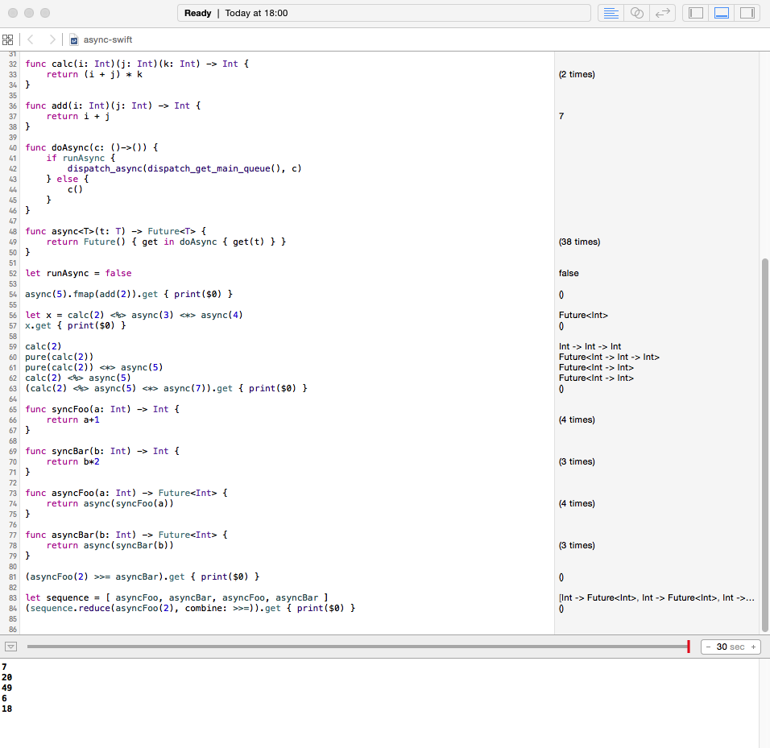

# applicative-cps-swift

We all hate [Callback Hell](http://callbackhell.com). It doesn't have to be a thing.

When I saw that [Continuation Passing Style](https://en.wikipedia.org/wiki/Continuation-passing_style) can be done using the `Cont` monad in Haskell, I had to see if this could be done in Swift too. It can, and it's nice.

### Watch out

The results of `dispatch_async()` are never seen in a playground. Comment out this line so that `async()` calls its completion closure synchronously, and you can see the results in the console.
